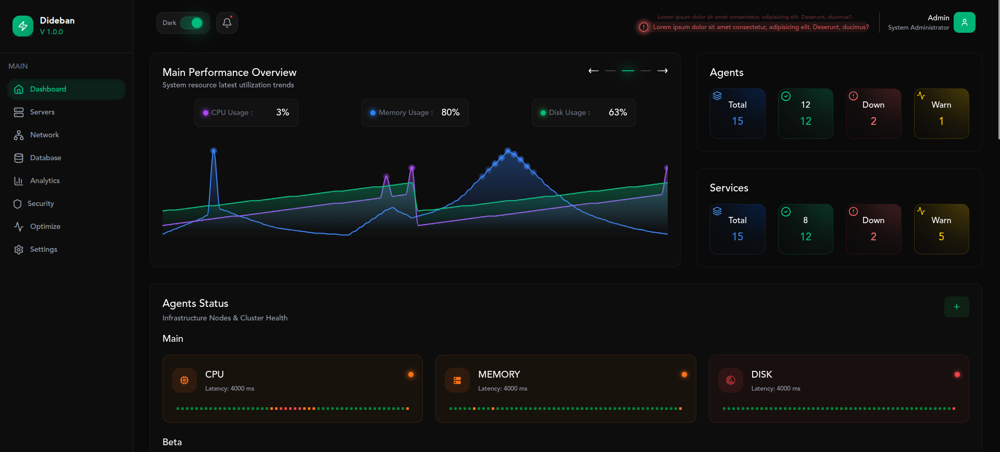

# Dideban Panel

Dideban Panel is a SvelteKit-based web dashboard for monitoring and control.
It uses Vite as the dev/build tool and Tailwind CSS for styling. The UI contains pages for Dashboard, Agents, Servers ,
Login, and other operational sections.

<p align="center">
  
</p>

---

## Key technologies

- SvelteKit
- Vite
- Tailwind CSS
- Prettier + ESLint (formatting and linting)

---

## Prerequisites

- Node.js (LTS)
- npm (or pnpm / yarn/ bun)

---

## Quick start

From the project root (this folder):

```bash
# install dependencies
npm install

# run dev server
npm run dev

# build for production
npm run build

# preview production build
npm run preview
```

---

## Available scripts (package.json)

- `dev` — run Vite dev server
- `build` — build a production bundle with Vite
- `preview` — preview the production build
- `prepare` — svelte-kit sync (project preparation)
- `format` — run Prettier to format files
- `lint` — run Prettier check and ESLint

---

## Project structure (high level)

- 📁  `src/` — application source
  - 📁  `routes/` — SvelteKit routes (+layout.svelte, +page.svelte)
  - 📁  `components/` — UI components
    - 📁  `components/common` — Common components
      - 📦 `components/common/Chart.svelte` — Performance overview chart component
    - 📁  `components/global` — Global components
      - 📦 `components/global/Topbar.svelte` — Topbar component ( Header of pages )
      - 📦 `components/global/sidebar/Sidebar.svelte` — Sidebar component
      - 📁 `components/global/sidebar/deps` — Deps components of Sidebar
        - 📦 `components/global/sidebar/deps/Support.svelte` — Support component 
    - 📁 `components/layouts` — layouts components
      - 📦 `components/layouts/MainLayout.svelte` — MainLayout component
    - 📁 `components/pages` — Components of each page
      - 📁 `components/pages/dashboard` — Components of dashboard page
        - 📦 `components/pages/dashboard/PerformanceOverview.svelte` — PerformanceOverview component
        - 📦 `components/pages/dashboard/TopRight.svelte` — TopRight component
        - 📁 `components/pages/dashboard/statusOverview` — statusOverview directory for StatusOverview component and it's deps components
          - 📦 `components/pages/dashboard/statusOverview/StatusOverview.svelte` — StatusOverview  component
          


  - 📁 `stores/` — Svelte stores 
    - 💾 `stores/theme.svelte.js` — Theme store for manage dark/light theme

  - 📁 `static/` — Static directory (images / fonts /icons / etc.)

- ⚙️ `svelte.config.js` — SvelteKit configuration
- ⚙️ `vite.config.js` — Vite configuration (includes Tailwind plugin)
- 🧱 `package.json` — scripts and deps

---
